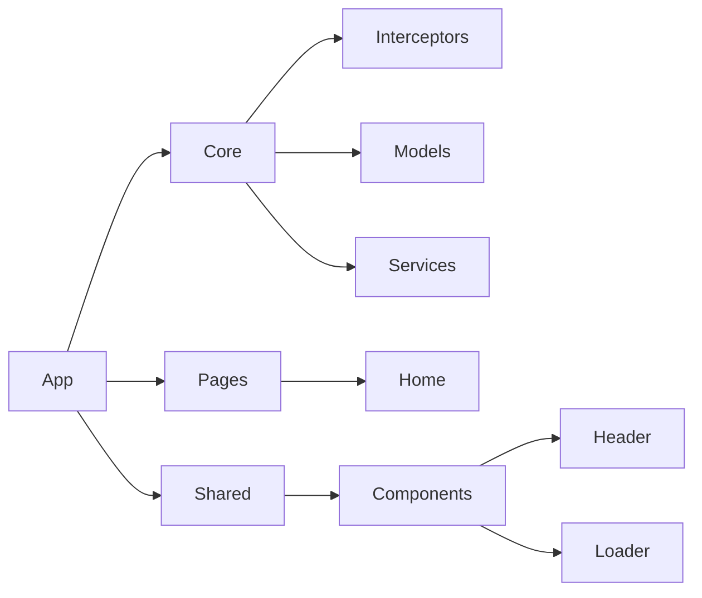
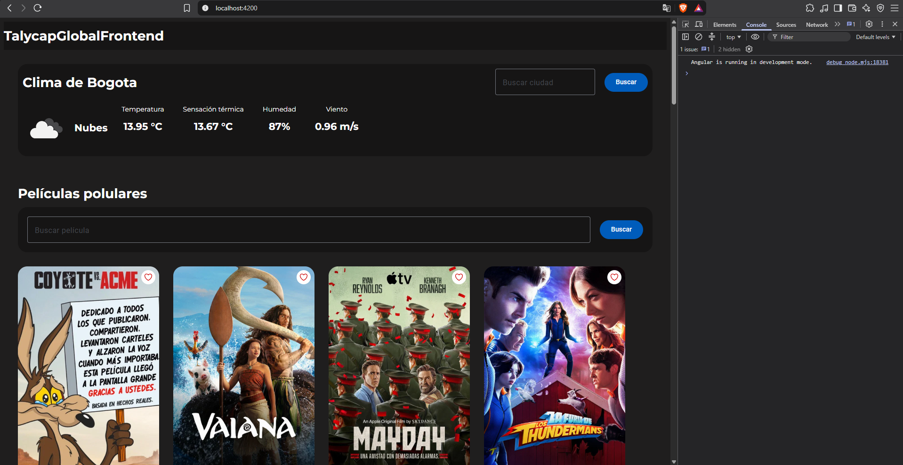
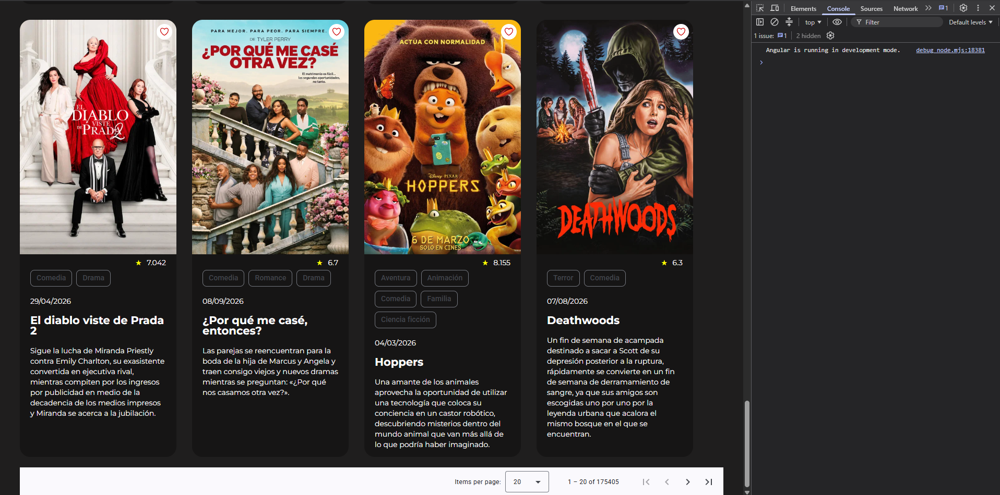

# Prueba Técnica TalycapGlobalFullStack - Frontend Angular

Este proyecto ha sido creado usando [Angular CLI](https://github.com/angular/angular-cli) en su versión 20.0.3.
Se instaló [Angular Material](https://material.angular.dev/) para poder usarse los componentes de esta UI. 


## Instalación de dependencias
```bash
npm i
```

## Ejecución local

```bash
ng serve
```

Una vez finalice se habilita podrá acceder directamente a la url `http://localhost:4200/` para que se pueda revisar, en caso contrario se puede acceder directamente a esta url donde se encuentra desplegado el sitio `https://stivengm.github.io/TalycapGlobalFrontend/`

## Arquitectura del proyecto
La arquitectura del proyecto es básica manteniendo la División de responsabilidades.



## Services

- Se consume los servicios de [TheMovieDB](https://www.themoviedb.org/) para obtener películas populares, a este se le hace un filtro por `Nombre`, `Categoría`.
- Se consume los servicios de [OpenWeatherMap](https://openweathermap.org/) para obtener información sobre los datos del clima, por defecto carga Bogotá y se puede filtrar por el nombre en el buscador

## Pantallazos de Pruebas



